# Business Therapy - Mentoria Mental Fitness | Technical Architecture

---

## 1. Introduction

This document defines the technical architecture for the **Business Therapy Mental Fitness Group Mentoring Landing Page** - a standalone Next.js site that reuses the design system from the existing Business Therapy Code website (`website/`).

**Enhancement Type:** New standalone landing page (sibling project)
**Integration Impact:** Low (shares design system via file copy, independent deployment)

### Existing Project Analysis

**Source Project:** `website/` (Business Therapy Code)

| Aspect | Current State |
|--------|---------------|
| **Primary Purpose** | Individual 1-to-1 mentoring landing page |
| **Tech Stack** | Next.js 16.1.6, React 19.2.3, TypeScript 5, Tailwind CSS 4, Framer Motion 12.29.2 |
| **Architecture Style** | Static single-page landing page (SSG), component-based |
| **Deployment** | Vercel |
| **Design System** | Gold (#fbbf24) / Navy (#0f172a), Playfair Display + Inter fonts |

**Available Documentation:**
- `website/docs/architecture.md` - Existing site architecture
- `website/docs/stories/` - 5 completed development stories

**Constraints:**
- No shared package infrastructure (not a monorepo)
- Design system must remain visually identical
- New project must be independently deployable

### Change Log

| Date | Version | Description | Author |
|------|---------|-------------|--------|
| 2026-01-30 | 0.1 | Initial architecture | Aria (@architect) |

---

## 2. Enhancement Scope & Integration Strategy

### Enhancement Overview

| Aspect | Value |
|--------|-------|
| **Enhancement Type** | New standalone project |
| **Scope** | Complete landing page for group mentoring program |
| **Integration Impact** | Low - file copy only, no runtime dependencies |

### Integration Approach

| Layer | Strategy |
|-------|----------|
| **Code Integration** | Copy 7 UI components + 4 lib files from `website/src/` |
| **Database Integration** | N/A - static site, no database |
| **API Integration** | N/A - no backend |
| **UI Integration** | Identical design system via copied `globals.css` |

### Compatibility Requirements

- **Existing API Compatibility:** N/A
- **Database Schema Compatibility:** N/A
- **UI/UX Consistency:** Must match gold/navy aesthetic exactly
- **Performance Impact:** Same targets as existing site (Lighthouse >90)

---

## 3. Tech Stack Alignment

### Existing Stack (Copy Verbatim)

| Category | Technology | Version | Usage | Notes |
|----------|------------|---------|-------|-------|
| Framework | Next.js | 16.1.6 | Full application | App Router |
| Runtime | React | 19.2.3 | UI rendering | Server + Client components |
| Language | TypeScript | 5.x | All source code | Strict mode |
| Styling | Tailwind CSS | 4.x | Utility classes | PostCSS plugin |
| Animation | Framer Motion | 12.29.2 | Scroll animations | Viewport-triggered |
| Fonts | Google Fonts | N/A | Inter + Playfair Display | Font swapping |
| Deployment | Vercel | N/A | Static hosting | SSG export |

### New Additions (Mentoria Only)

| Technology | Version | Purpose | Rationale |
|------------|---------|---------|-----------|
| None | - | - | No new dependencies required |

All functionality can be achieved with the existing stack. The 4 new interactive components and 2 custom hooks are built with React + Framer Motion.

---

## 4. Data Models

### Content Model (constants.ts)

No database. All content is statically typed in `src/lib/constants.ts`:

```typescript
// Site configuration
export const SITE = {
  name: string;
  author: string;
  email: string;
  whatsapp: string;
  linkedin: string;
  instagram: string;
}

// Navigation
export const NAV_ITEMS = Array<{ label: string; href: string; }>

// Section content (one per section)
export const HERO = { headline, subheadline, ctaPrimary, ctaSecondary, badges }
export const PROBLEM = { title, subtitle, narrative, checklistItems, thresholds }
export const FRAMEWORK = { title, quote, games: Array<Game>, videoUrl? }
export const HOW_IT_WORKS = { format, timeline: Array<Step>, startDate }
export const RESULTS = { scienceStats, metrics, testimonials, roi }
export const COMPARISON = { features, columns: Array<Column> }
export const ABOUT = { bio?, credentials, photo?, stats }
export const FOR_WHO = { idealProfile, exclusions }
export const INVESTMENT = { preLaunchPrice, regularPrice, bonuses, guarantee, paymentOptions }
export const URGENCY = { deadline: string, totalVacancies, filledVacancies }
export const FAQS = Array<{ question: string; answer: string; }>
export const NEXT_STEPS = { steps: Array<Step> }
export const CTA_FINAL = { title, ctaPrimary, ctaSecondary, badges, closing }
```

### Schema Integration Strategy

- **New Tables:** None
- **Modified Tables:** None
- **Migration Strategy:** N/A (static content)
- **Backward Compatibility:** N/A

---

## 5. Component Architecture

### Component Inventory

#### Copied from `website/` (7 UI + 4 lib)

| Component | Source Path | Purpose |
|-----------|-------------|---------|
| `Button` | `src/components/ui/Button.tsx` | CTA buttons (primary/secondary/ghost) |
| `Card` | `src/components/ui/Card.tsx` | Content containers with hover effects |
| `SectionHeader` | `src/components/ui/SectionHeader.tsx` | Section titles with gold line |
| `Badge` | `src/components/ui/Badge.tsx` | Status indicators (gold/red/green) |
| `Accordion` | `src/components/ui/Accordion.tsx` | FAQ expandable items |
| `AnimatedCounter` | `src/components/ui/AnimatedCounter.tsx` | Number animations |
| `WhatsAppButton` | `src/components/ui/WhatsAppButton.tsx` | Floating contact button |
| `globals.css` | `src/app/globals.css` | Design system tokens |
| `animations.ts` | `src/lib/animations.ts` | Framer Motion variants |
| `analytics.ts` | `src/lib/analytics.ts` | GA4 event helpers |
| `Analytics.tsx` | `src/components/providers/Analytics.tsx` | Analytics provider |

#### New Components (Mentoria-specific)

**Hooks:**

| Hook | Purpose | Interface |
|------|---------|-----------|
| `useCountdown` | SSR-safe countdown timer | `(deadline: string) => { days, hours, minutes, seconds, isExpired }` |
| `useChecklist` | Checkbox state management | `(total: number) => { checked: Set, count, toggle, reset }` |

**UI Components:**

| Component | Purpose | Props |
|-----------|---------|-------|
| `InteractiveChecklist` | Symptom self-assessment | `items: string[], thresholds: Threshold[]` |
| `CountdownTimer` | Deadline countdown display | `deadline: string, compact?: boolean` |
| `ComparisonGrid` | 3-column comparison table | `features: string[], columns: Column[]` |
| `VideoEmbed` | YouTube/Vimeo embed with placeholder | `url?: string, placeholder?: string` |

**Layout Components:**

| Component | Purpose | Notes |
|-----------|---------|-------|
| `UrgencyBar` | Sticky top bar with countdown | Appears after hero scroll, dismissible |

**Section Components (14 total):**

| Component | Section ID | FR Reference |
|-----------|------------|--------------|
| `Hero.tsx` | `#hero` | FR1 |
| `ProblemChecklist.tsx` | `#problema` | FR2 |
| `Framework.tsx` | `#metodo` | FR3 |
| `HowItWorks.tsx` | `#como-funciona` | FR4 |
| `ResultsProof.tsx` | `#resultados` | FR5 |
| `ComparisonTable.tsx` | `#comparacao` | FR6 |
| `AboutCarol.tsx` | `#sobre` | FR7 |
| `ForWho.tsx` | `#para-quem` | FR8 |
| `Investment.tsx` | `#investimento` | FR9 |
| `Urgency.tsx` | `#urgencia` | FR10 |
| `FAQ.tsx` | `#faq` | FR12 |
| `NextSteps.tsx` | `#proximos-passos` | FR13 |
| `CTAFinal.tsx` | `#decisao` | FR14 |

### Component Interaction Diagram

```mermaid
graph TD
    subgraph "App Shell"
        Layout[layout.tsx]
        Page[page.tsx]
    end

    subgraph "Layout Components"
        Navbar[Navbar.tsx]
        Footer[Footer.tsx]
        UrgencyBar[UrgencyBar.tsx]
        SectionDots[SectionDots.tsx]
        WhatsApp[WhatsAppButton.tsx]
    end

    subgraph "Content Sections"
        Hero[Hero.tsx]
        Problem[ProblemChecklist.tsx]
        Framework[Framework.tsx]
        HowItWorks[HowItWorks.tsx]
        Results[ResultsProof.tsx]
        Comparison[ComparisonTable.tsx]
        About[AboutCarol.tsx]
        ForWho[ForWho.tsx]
        Investment[Investment.tsx]
        Urgency[Urgency.tsx]
        FAQ[FAQ.tsx]
        NextSteps[NextSteps.tsx]
        CTAFinal[CTAFinal.tsx]
    end

    subgraph "UI Primitives"
        Button[Button.tsx]
        Card[Card.tsx]
        SectionHeader[SectionHeader.tsx]
        Badge[Badge.tsx]
        Accordion[Accordion.tsx]
        AnimatedCounter[AnimatedCounter.tsx]
    end

    subgraph "New Interactive"
        InteractiveChecklist[InteractiveChecklist.tsx]
        CountdownTimer[CountdownTimer.tsx]
        ComparisonGrid[ComparisonGrid.tsx]
        VideoEmbed[VideoEmbed.tsx]
    end

    subgraph "Hooks"
        useCountdown[useCountdown.ts]
        useChecklist[useChecklist.ts]
    end

    subgraph "Lib"
        constants[constants.ts]
        animations[animations.ts]
    end

    Layout --> Page
    Layout --> Navbar
    Layout --> Footer
    Layout --> UrgencyBar
    Layout --> SectionDots
    Layout --> WhatsApp

    Page --> Hero
    Page --> Problem
    Page --> Framework
    Page --> HowItWorks
    Page --> Results
    Page --> Comparison
    Page --> About
    Page --> ForWho
    Page --> Investment
    Page --> Urgency
    Page --> FAQ
    Page --> NextSteps
    Page --> CTAFinal

    Problem --> InteractiveChecklist
    InteractiveChecklist --> useChecklist

    Framework --> VideoEmbed

    Comparison --> ComparisonGrid

    Urgency --> CountdownTimer
    UrgencyBar --> CountdownTimer
    CountdownTimer --> useCountdown

    Hero --> Button
    Hero --> Badge
    Investment --> Card
    Investment --> Button
    FAQ --> Accordion
    Results --> AnimatedCounter

    Hero --> constants
    Problem --> constants
    Framework --> constants
```



---

## 6. Source Tree Integration

### Complete Directory Structure

```
mentoria/
├── .gitignore
├── .env.example
├── package.json
├── package-lock.json
├── tsconfig.json
├── postcss.config.mjs
├── eslint.config.mjs
├── next.config.ts
├── README.md
│
├── docs/
│   ├── prd.md                          # Product requirements
│   ├── architecture.md                 # This document
│   └── stories/
│       └── (story files)
│
├── public/
│   ├── favicon.ico
│   └── (images when provided)
│
└── src/
    ├── app/
    │   ├── globals.css                 # COPIED - Design system
    │   ├── layout.tsx                  # Root layout with fonts, metadata
    │   ├── page.tsx                    # Assembles all sections
    │   ├── favicon.ico
    │   └── opengraph-image.tsx         # Dynamic OG image
    │
    ├── components/
    │   ├── layout/
    │   │   ├── Navbar.tsx              # ADAPTED - New nav items
    │   │   ├── Footer.tsx              # ADAPTED - New branding
    │   │   ├── SectionDots.tsx         # ADAPTED - New section IDs
    │   │   └── UrgencyBar.tsx          # NEW - Sticky countdown bar
    │   │
    │   ├── providers/
    │   │   └── Analytics.tsx           # COPIED - GA4 provider
    │   │
    │   ├── sections/
    │   │   ├── Hero.tsx                # NEW
    │   │   ├── ProblemChecklist.tsx    # NEW
    │   │   ├── Framework.tsx           # NEW
    │   │   ├── HowItWorks.tsx          # NEW
    │   │   ├── ResultsProof.tsx        # NEW
    │   │   ├── ComparisonTable.tsx     # NEW
    │   │   ├── AboutCarol.tsx          # NEW
    │   │   ├── ForWho.tsx              # NEW
    │   │   ├── Investment.tsx          # NEW
    │   │   ├── Urgency.tsx             # NEW
    │   │   ├── FAQ.tsx                 # NEW
    │   │   ├── NextSteps.tsx           # NEW
    │   │   └── CTAFinal.tsx            # NEW
    │   │
    │   └── ui/
    │       ├── Button.tsx              # COPIED
    │       ├── Card.tsx                # COPIED
    │       ├── SectionHeader.tsx       # COPIED
    │       ├── Badge.tsx               # COPIED
    │       ├── Accordion.tsx           # COPIED
    │       ├── AnimatedCounter.tsx     # COPIED
    │       ├── WhatsAppButton.tsx      # COPIED + message update
    │       ├── InteractiveChecklist.tsx # NEW
    │       ├── CountdownTimer.tsx      # NEW
    │       ├── ComparisonGrid.tsx      # NEW
    │       └── VideoEmbed.tsx          # NEW
    │
    ├── hooks/
    │   ├── useCountdown.ts             # NEW
    │   └── useChecklist.ts             # NEW
    │
    └── lib/
        ├── constants.ts                # NEW - All content
        ├── animations.ts               # COPIED
        └── analytics.ts                # COPIED
```

### File Count Summary

| Category | Copied | Adapted | New | Total |
|----------|--------|---------|-----|-------|
| Config files | 4 | 1 | 2 | 7 |
| UI components | 6 | 1 | 4 | 11 |
| Layout components | 0 | 3 | 1 | 4 |
| Section components | 0 | 0 | 13 | 13 |
| Hooks | 0 | 0 | 2 | 2 |
| Lib files | 2 | 0 | 1 | 3 |
| App files | 1 | 0 | 3 | 4 |
| **Total** | **13** | **5** | **26** | **44** |

### Integration Guidelines

- **File Naming:** kebab-case for all files (matches existing site)
- **Folder Organization:** Feature-based grouping (sections/, ui/, layout/, hooks/)
- **Import Patterns:** `@/` alias for `src/` (defined in tsconfig.json)
- **Export Patterns:** Named exports for components, default for pages

---

## 7. New Component Specifications

### 7.1 useCountdown Hook

```typescript
// src/hooks/useCountdown.ts

interface CountdownState {
  days: number;
  hours: number;
  minutes: number;
  seconds: number;
  isExpired: boolean;
}

export function useCountdown(deadline: string): CountdownState {
  // SSR-safe: returns zeros on server
  // Starts interval in useEffect (client only)
  // Cleans up interval on unmount
  // Returns isExpired: true when deadline passes
}
```

**Implementation Notes:**
- Use `useState` with initial zeros for SSR safety
- `useEffect` with `setInterval(1000)` for client-side updates
- Calculate diff using `new Date(deadline).getTime() - Date.now()`
- Return floor values for each time segment

### 7.2 useChecklist Hook

```typescript
// src/hooks/useChecklist.ts

interface ChecklistState {
  checked: Set<number>;
  count: number;
  toggle: (index: number) => void;
  reset: () => void;
}

export function useChecklist(totalItems: number): ChecklistState {
  // Manages Set<number> of checked indices
  // toggle() adds/removes from set
  // count is Set.size
  // reset() clears the set
}
```

### 7.3 InteractiveChecklist Component

```typescript
// src/components/ui/InteractiveChecklist.tsx
"use client"

interface Threshold {
  count: number;
  message: string;
}

interface InteractiveChecklistProps {
  items: string[];
  thresholds: Threshold[];
  className?: string;
}

// Renders:
// - List of checkboxes with labels
// - Live counter: "X de Y selecionados"
// - Dynamic message based on count matching threshold
// - Framer Motion animations on check/uncheck
// - Accessibility: role="checkbox", aria-checked, keyboard support
```

**Visual Design:**
- Each item in a `Card` component
- Gold check animation when checked
- Counter uses muted text color
- Threshold message uses gold text when triggered

### 7.4 CountdownTimer Component

```typescript
// src/components/ui/CountdownTimer.tsx
"use client"

interface CountdownTimerProps {
  deadline: string; // ISO date string
  compact?: boolean; // true for UrgencyBar
  labels?: {
    days: string;
    hours: string;
    minutes: string;
    seconds: string;
  };
  className?: string;
}

// Renders:
// - 4 time segments with labels (default: dias, horas, min, seg)
// - compact mode: inline, no labels, smaller text
// - Expiry state: shows "Encerrado" or hides
// - Gold text for numbers, muted for labels
```

### 7.5 ComparisonGrid Component

```typescript
// src/components/ui/ComparisonGrid.tsx
"use client"

interface Column {
  name: string;
  highlighted?: boolean;
  values: Record<string, string>;
}

interface ComparisonGridProps {
  features: string[];
  columns: Column[];
  className?: string;
}

// Renders:
// - Desktop: Full table with header row and feature rows
// - Mobile: Stacked cards per column
// - Highlighted column (Mental Fitness) uses gold border
// - Check/cross icons for boolean values
// - Responsive breakpoint at md (768px)
```

### 7.6 VideoEmbed Component

```typescript
// src/components/ui/VideoEmbed.tsx
"use client"

interface VideoEmbedProps {
  url?: string; // YouTube or Vimeo URL
  placeholder?: string; // Placeholder image URL
  aspectRatio?: string; // default "16/9"
  className?: string;
}

// Renders:
// - If url: iframe with loading="lazy"
// - If no url: Placeholder card with play button overlay
// - 16:9 aspect ratio container
// - glass-card class for placeholder state
// - Rounded corners matching --radius-card
```

### 7.7 UrgencyBar Component

```typescript
// src/components/layout/UrgencyBar.tsx
"use client"

interface UrgencyBarProps {
  deadline: string;
  vacancyText: string;
  ctaText: string;
  ctaHref: string;
}

// Renders:
// - Fixed position at top (z-60)
// - Appears after scrolling past hero (IntersectionObserver)
// - Contains: compact CountdownTimer + vacancy text + CTA button
// - Dismiss X button (persists to sessionStorage)
// - Background: --color-bg-primary with slight transparency
// - Height: ~44px
// - Pushes Navbar down when visible
```

---

## 8. Infrastructure & Deployment

### Existing Infrastructure (Reference)

| Aspect | `website/` Configuration |
|--------|--------------------------|
| **Deployment** | Vercel (automatic from GitHub) |
| **Domain** | businesstherapycode.com |
| **Environment** | Production only |
| **Build** | Static SSG export |

### Enhancement Deployment Strategy

| Aspect | `mentoria/` Configuration |
|--------|---------------------------|
| **Deployment** | Vercel (separate project) |
| **Domain** | TBD (e.g., mentoria.businesstherapycode.com or separate) |
| **Environment** | Production only |
| **Build** | Static SSG export |

**Infrastructure Changes:** None - new Vercel project only

**Pipeline Integration:**
- New GitHub repo or subdirectory
- Vercel auto-deploy on push to main
- Environment variables via Vercel dashboard

### Rollback Strategy

- **Method:** Vercel instant rollback to previous deployment
- **Risk Mitigation:** Static site, no database, no breaking changes possible
- **Monitoring:** Vercel Analytics + GA4

---

## 9. Coding Standards

### Existing Standards (From `website/`)

| Aspect | Standard |
|--------|----------|
| **Code Style** | Prettier defaults, single quotes, no semicolons |
| **Linting** | ESLint with Next.js recommended + strict TypeScript |
| **Component Pattern** | `"use client"` for interactive, server by default |
| **Styling** | Tailwind utilities + CSS custom properties |
| **Animation** | Framer Motion with shared variants from `animations.ts` |
| **Documentation** | Inline JSDoc for complex functions |

### Enhancement-Specific Standards

- **Content Management:** All user-facing text in `constants.ts` (no hardcoded strings in components)
- **Copy Fidelity:** PT-BR copy must match original document exactly (accents, punctuation)
- **Accessibility:** All new interactive components must include ARIA labels and keyboard support

### Critical Integration Rules

| Rule | Implementation |
|------|----------------|
| **CSS Variables** | Always use `var(--color-*)` from globals.css |
| **Animation Variants** | Import from `@/lib/animations`, never define inline |
| **Error Handling** | Client components: try/catch with console.error |
| **Logging** | Development only via `console.log` (no production logging) |

---

## 10. Testing Strategy

### Existing Test Integration

| Aspect | Current State |
|--------|---------------|
| **Framework** | None in MVP |
| **Organization** | N/A |
| **Coverage** | Manual testing only |

### Testing Requirements for Mentoria

| Test Type | Scope | Method |
|-----------|-------|--------|
| **Build** | All code | `npm run build` - zero errors |
| **Lint** | All code | `npm run lint` - zero warnings |
| **Type Check** | All code | `npx tsc --noEmit` - passes |
| **Visual** | All sections | Manual at 375px, 768px, 1280px, 1920px |
| **Interactive** | New components | Manual: checklist toggle, countdown tick, accordion |
| **Accessibility** | All pages | Manual keyboard nav, Lighthouse audit |
| **Performance** | Full page | Lighthouse >90 |

### Regression Testing

- **Existing Feature Verification:** N/A (new project)
- **Automated Regression:** None in MVP
- **Manual Testing:** Checklist-based final QA

---

## 11. Security Integration

### Existing Security Measures (From `website/`)

| Aspect | Implementation |
|--------|----------------|
| **Authentication** | N/A (static site) |
| **Authorization** | N/A |
| **Data Protection** | No user data collected |
| **Security Headers** | CSP, HSTS, X-Frame-Options, etc. in next.config.ts |

### Enhancement Security Requirements

- **New Security Measures:** None beyond existing headers
- **CSP Update:** Add YouTube and Vimeo to `frame-src` directive
- **Compliance:** No PII collection, no GDPR requirements

### Security Headers (next.config.ts)

```typescript
const securityHeaders = [
  {
    key: "Content-Security-Policy",
    value: [
      "default-src 'self'",
      "script-src 'self' 'unsafe-inline' 'unsafe-eval' https://www.googletagmanager.com https://www.google-analytics.com",
      "style-src 'self' 'unsafe-inline' https://fonts.googleapis.com",
      "font-src 'self' https://fonts.gstatic.com data:",
      "img-src 'self' data: blob: https:",
      "connect-src 'self' https://www.google-analytics.com https://analytics.google.com",
      "frame-src https://www.youtube.com https://player.vimeo.com", // UPDATED for video embeds
      "media-src 'self'",
      "object-src 'none'",
      "base-uri 'self'",
      "form-action 'self'",
      "frame-ancestors 'none'",
    ].join("; "),
  },
  // ... other headers same as website/
];
```

---

## 12. Checklist Results Report

### Architect Checklist

- [x] Tech stack aligned with existing project
- [x] No unnecessary new dependencies
- [x] Component reuse strategy documented
- [x] New components fully specified
- [x] Directory structure follows existing patterns
- [x] SSR safety addressed (useCountdown hook)
- [x] Accessibility requirements embedded in component specs
- [x] Security headers updated for video embeds
- [x] Performance targets defined (Lighthouse >90)
- [x] Deployment strategy independent of existing site

---

## 13. Next Steps

### Story Manager Handoff

> @sm: Create formal story files in `mentoria/docs/stories/` based on the PRD at `mentoria/docs/prd.md`. The architecture document at `mentoria/docs/architecture.md` provides component specifications and file structure. Key points:
>
> - 3 epics, 10 stories already defined in PRD
> - Story 1.1 is the critical path (project scaffolding)
> - Stories 1.2 and 2.1 can potentially run in parallel after 1.1
> - Each story should reference specific files from the architecture doc

### Developer Handoff

> @dev: Implement the Business Therapy Mentoria landing page following:
>
> 1. **PRD:** `mentoria/docs/prd.md` - Requirements and acceptance criteria
> 2. **Architecture:** `mentoria/docs/architecture.md` - Component specs and file structure
> 3. **Source Reference:** `website/src/` - Copy design system and UI components
>
> **Critical Implementation Order:**
> 1. Story 1.1: Scaffold project with dependencies
> 2. Story 1.2: Copy design system and UI components
> 3. Story 1.3: Layout shell (Navbar, Footer, UrgencyBar)
> 4. Story 2.1: New interactive components (hooks + UI)
> 5. Stories 2.2-2.7: Content sections (can be parallelized)
> 6. Story 3.1-3.2: SEO and final QA
>
> **Key Files to Copy First:**
> - `website/src/app/globals.css`
> - `website/src/lib/animations.ts`
> - All files in `website/src/components/ui/`

---

*— Aria, arquitetando o futuro*
